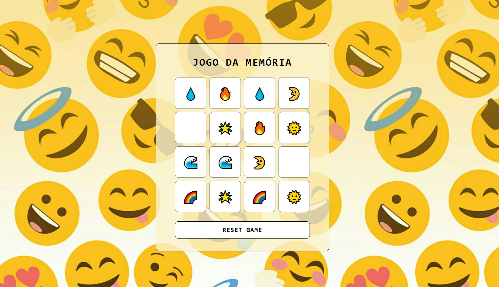
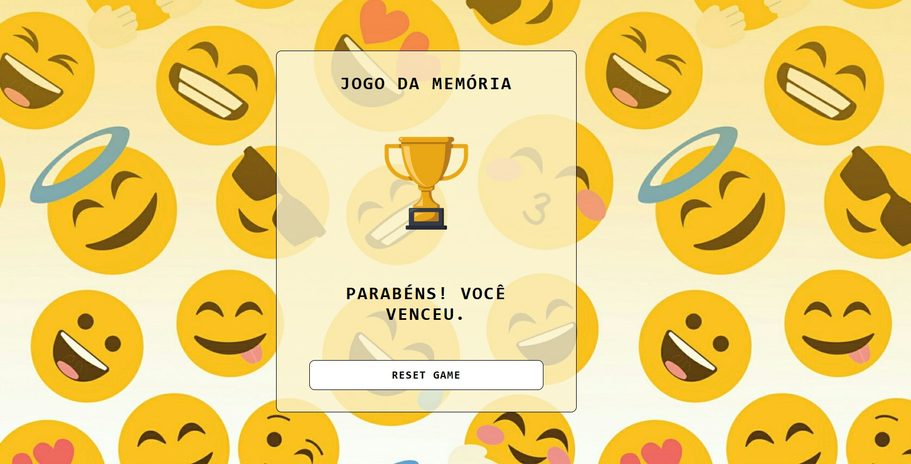

# Jogo da Memória com Emojis 😎😅😆

Desenvolvido como parte de um desafio da Digital Innovation One (DIO), este jogo da memória foi criado em JavaScript utilizando emojis ou fotos como tema principal.

## Tecnologias Utilizadas 🛠

- **HTML5** e **CSS3**: Estrutura e aparência do jogo.
- **JavaScript**: Lógica de programação e interatividade.
- **Sprites e Imagens Customizadas**: Criação de uma estética única para o jogo.

## Funcionalidades ⚙🔍

- **Sistema de Cartas**: 
  - Ao virar uma carta, se um par for localizado, ele permanece visível até o final do jogo.
  - Caso as cartas não sejam do mesmo tipo, elas retornam ao estado original, viradas para baixo.
- **Troféu**: 
  - Ao completar todas as cartas, o jogador ganha um troféu!

## Como Jogar 🎮

1. **Baixe o Jogo**: Clone este repositório para sua máquina local.
2. **Inicie o Jogo**: Abra o arquivo `index.html` no seu navegador web.
3. **Encontre os Pares**: Clique nas cartas para encontrar e combinar os pares.

## Contribuição 🤝

Contribuições são bem-vindas! Se você deseja melhorar o jogo, adicionar novos recursos ou corrigir problemas, sinta-se à vontade para abrir um pull request.

## Créditos

Este jogo foi desenvolvido como parte de um desafio da **Digital Innovation One (DIO)**.
